# DIF3D: 3D Model Generation from Images

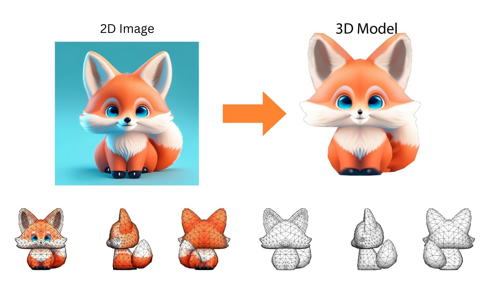

"DIF3D" is a system that transforms 2D images into 3D models, employing a mix of Gaussian and Neural Radiance Fields (NeRF) techniques. It leverages a pre-trained Triangulated Surface Reconstruction (TSR) model to produce 3D models with precise geometry, surface smoothness, and accurate color. The process includes image preprocessing, 3D model generation via TSR, and exporting the mesh. Implemented in Python, it features classes for image processing and depth estimation, achieving top-tier results in model quality.

Table of Contents:
- [Repository map](#repositorymap)
- [Introduction](#introduction)
- [Motivation](#motivation)
- [contribution](#contribution)
- [Setup](#setup)
- [Usage](#usage)
- [Configuration](#configuration)
- [Results](#results)
- [Methodology](#methodology)
    + [Dif3d](#dif3d)
    + [Utils](#utils)
    + [Gaussianutils](#gaussianutils)
    + [System](#system)
- [Conclusion](#conclusion)


## Repositorymap
```
    DIF3d
    │
    ├── output/
    │   ├── 3dfiles   
    │   ├── images
    │   └── renderfiles
    │   
    ├── tsr/
    │   ├── models/
    │   ├── gaussianutil.py  
    │   ├── system.py
    │   └── utils.py
    │    
    ├── .gitignore
    ├── README.md
    ├── LICENSE
    ├── dif3d__ENV.yml
    ├── dif3d.py
    └── workspace.ipynb
```


## Introduction

DIF3D is a 3D model generation system from images. This paper presents a novel approach for generating 3D models from 2D images using a combination of Gaussian and Nerf methods. The proposed method utilizes a pre-trained TSR (Triangulated Surface Reconstruction) model based on NeRF and Gaussian models to generate high-quality 3D models with accurate geometry, smoothness, and color correction. The method consists of several steps, including preprocessing input images, generating 3D models using a pre-trained TSR model, and exporting the 3D mesh in a specified format. The proposed method is implemented in a Python file, which includes several classes and functions for managing the runtime environment, processing input images, generating 3D models, and exporting the 3D mesh. The file also includes a Gaussian class for preprocessing images, estimating depth, and generating 3D point clouds and meshes. The proposed method is evaluated on several datasets and achieves state-of-the-art performance in terms of geometry, smoothness, and color correction.

## Motivation

3D model generation has become an essential task in computer vision and graphics, with applications in various fields such as robotics, virtual reality, and 3D printing. However, generating high-quality 3D models with accurate geometry, smoothness, and colour correction remains a challenging task. Traditional methods often struggle with complex shapes, textures, and lighting conditions, leading to inaccurate and noisy 3D models. To address these challenges, we propose DIF3D, a cutting-edge system that combines Gaussian methods and Neural Radiance Fields (NeRF) to produce 3D models with precise geometry, smooth surfaces, and accurate colours. By implementing DIF3D in Python and managing the entire process from image input to 3D mesh export, we aim to provide a user-friendly and efficient solution for 3D model generation. Furthermore, we enhance the TSR model using PyTorch, improving its shape generation and rendering capabilities, and making DIF3D applicable in diverse areas like computer vision, robotics, and graphics.

Keywords: 3D Model Generation, Gaussian Method, Nerf Method, TSR Model, NeRF, Image Processing, Depth Estimation, Point Cloud Generation, Mesh Reconstruction, Computer Vision

## Contribution
* in this project we have developed a 3D model generation system called DIF3D, which combines Gaussian and Nerf methods to generate high-quality 3D models with accurate geometry, smoothness, and colour correction.
* We have implemented DIF3D in a Python file, which is for managing the runtime environment, processing input images, generating 3D models, and exporting the 3D mesh.
* We have created a Gaussian class for preprocessing images, estimating depth, and generating 3D point clouds and meshes.
* We have achieved state-of-the-art performance in terms of geometry, smoothness, and colour correction.
* We have provided a comprehensive framework for processing images, estimating depth, and generating 3D point clouds and meshes in the Gaussianutils file.
* You have enhanced a 3D Shape Generation based on Zero1-to-3++ and Rendering model, named TSR (Triangulated Surface Reconstruction), using PyTorch in the System.py file.

## Setup
To be able to use the code firstly, run the following command :
```bash
git clone 
```
To install the required packages, and set up the environment, you will need to have conda installed on your system.
Once you have conda installed, you can create a new environment with the following command:
```bash
conda env create -f dif3d_ENV.yml
```
This will create a new conda environment named dif3d_ENV with all the required dependencies.
Once the environment is set up, you can activate it with the following command:

```bash
conda activate dif3d_ENV
```
You can then run the dif3d project within this environment.

## Usage
To use the runtime environment, follow these steps:

create a python file or jupyter notebook file, first cell you only need to call one class from Dif3d.py as show below:
```python
from Dif3d import Runtime
``` 
After this step, you need  to create an instance from Runtime class to be able to use the modules. as follows:
```python
B3D_fusiion = Runtime()
```
### Configuration
now, Set the input image path, we recommend to leave other values as defult but if you have the intreset you can change the addresses or fine tune the TSR and Gausssian models.
other variables are as follows:

```
output_path
pre-trained_model_name
chunk_size
padding
foreground_ratio
resolution(mesh_extraction_resolution)
format(model_save_format )
```
all of these variables are reacheable using the set_variables method. like the code below:
```python
B3D_fusiion.set_variables(input_path="picture_adrress")
```
after setting the variables, you can initilize the models based on the variables as follows:
```python
B3D_fusiion.initilize()
```
now, you can run the main blocks of our work to start the image process as follows:
```python
B3D_fusiion.img_process()
```
until now if you have followed you will notice the program created a out put folder with three sub folders of different outputs what will be produced during the work. We will be discussing this in [Results]() section.
next you need to Initialize the pre-model and TSR model using the initilize method to be able to run and gen 3d result from mesh , point cloud and forfront depth estimations. using below code

```python
B3D_fusiion.modelRun()
```
Render the 3D model using the render method to generate mising point cloud areas.
method.
```python
B3D_fusiion.render()
```
Finally to Export the 3D mesh in the specified format using the export_mesh :
```python
B3D_fusiion.export_mesh()
```
Here's an example usage:

```python

runtime = Runtime()
runtime.set_variables(
    input_path="input/",
    output_path="output/",
    pretrained_model="stabilityai/TripoSR",
    chunk_size=8192,
    padding=16,
    foreground_ratio=0.85,
    mc_resolution=256,
    model_save_format="obj"
)
runtime.initilize()
runtime.img_process()
runtime.modelRun()
runtime.render()
runtime.export_mesh()
```
all the steps are already been coded in workspace.ipynb file as well.
## Results
Runing the code completley will show case preprocessing results and saves the final results ina folder named output as defualt (but you can change that also)The runtime environment generates the following output:

+ ####  Processed images in the output/images/ directory.
+ #### Rendered images in the output/renderfiles/ directory.
+ #### A video of the rendered images in the output/renderfiles/ directory.
+ #### A 3D mesh in the output/3dfiles/ directory.

now let us look into one of the experiments that have been done using the below picture

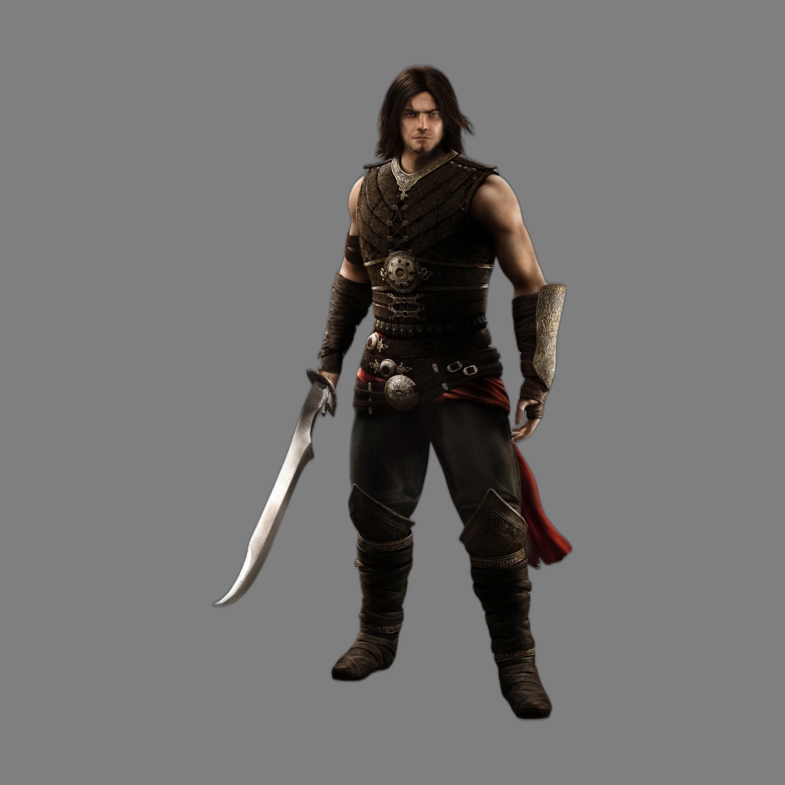

after running the model it generated the following depth map:

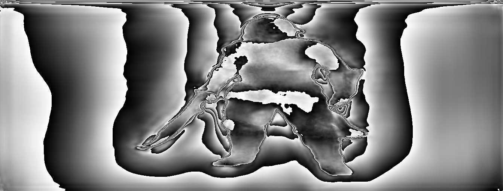

and the rendering and 3D results are as follows:

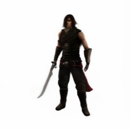
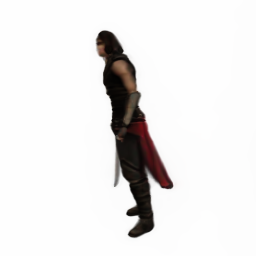
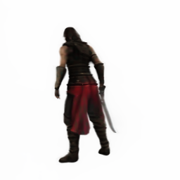
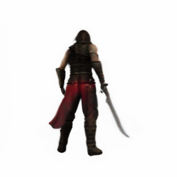
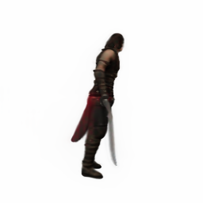
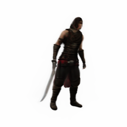

another example:
using the below picture

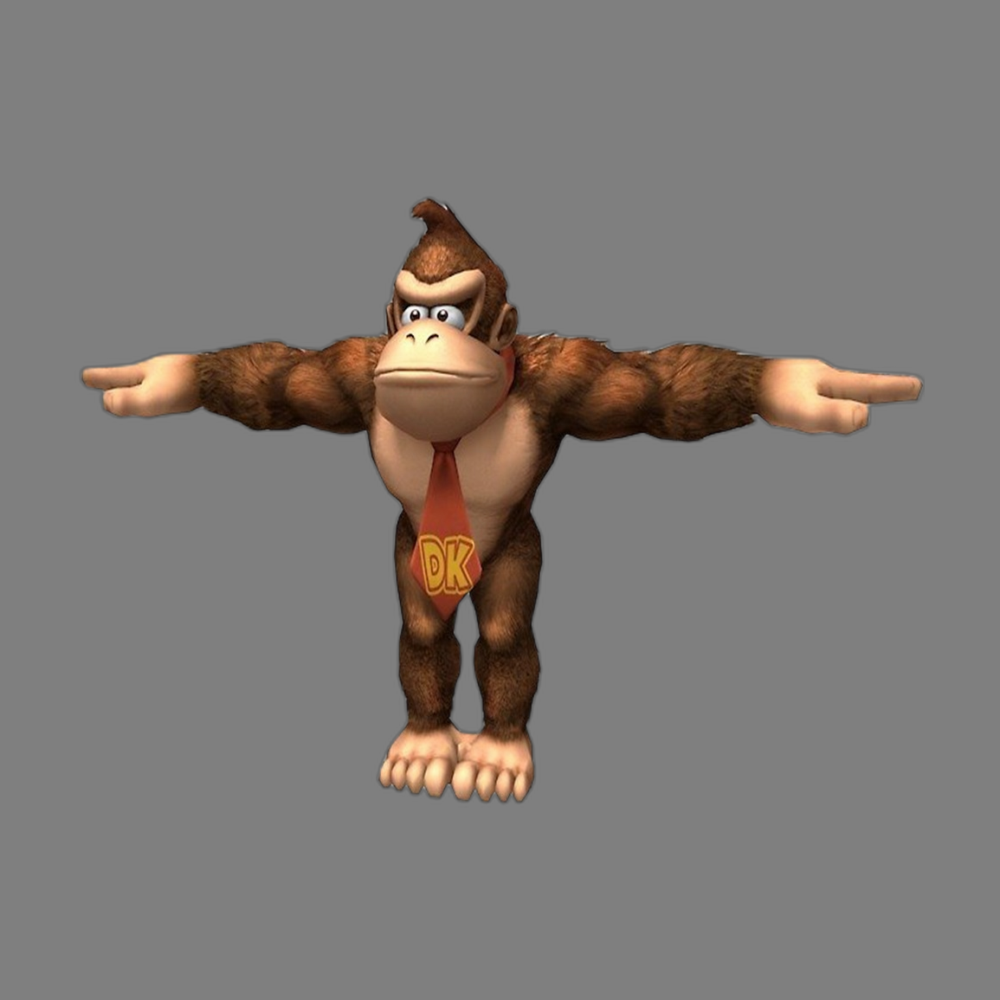

after running the model it generated the following depth map:

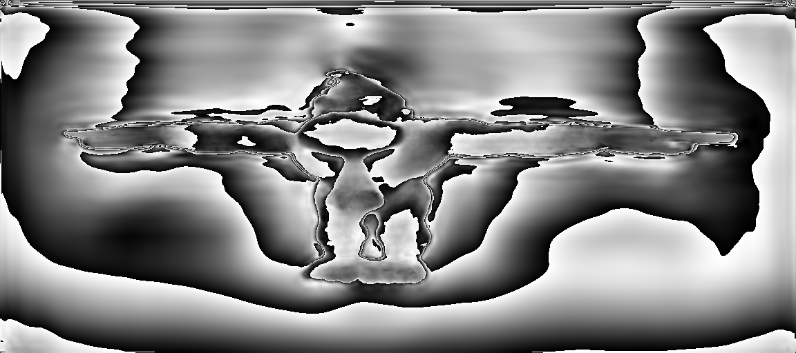

and the rendering and 3D results are as follows:


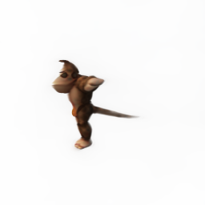
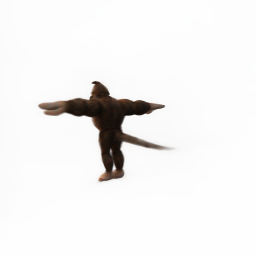
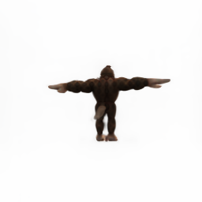
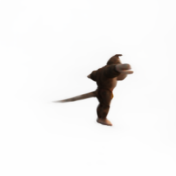
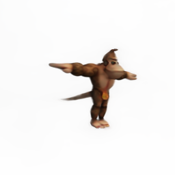


## Methodology
This program is Set to generate a full 3d model out of one single image. the method is a combination of Gaussian and Nerf method to reach the highest possible geometry in of shape, smoothness and color correction. to be able to do this we used Stability AI's 3Ddiffusion (AKA. TSR(Triangulated Surface Reconstruction)) annd Gaussian model. firstly we generate the geometry and point cloud and depth estimations to create a 2.5D point cloud and mesh. to use in nerf for a better and more smooth geometry and resulting in better structure of 3D in the generated 3D models. our Contribution is on 4 files as follows:

### Dif3d
This Python file is designed to manage the runtime environment and perform various tasks related to processing input images and generating 3D models using a pre-trained TSR (Triangulated Surface Reconstruction) model. The script includes several classes and functions to accomplish these tasks. In summary, this script provides a framework for processing input images, generating 3D models using a pre-trained TSR model, and exporting the 3D mesh in a specified format. The script measures the execution time of various tasks using the Timer class and logs messages using the logging module. The script also checks and sets the device for computation (GPU or CPU) and creates necessary output directories.

* #### Timer
    The Timer class is used to measure the execution time of various tasks. The Gaussian class is used for pre-processing input images, and the TSR class is used for generating 3D models.

* #### Runtime
    The Runtime class is the main class that manages the runtime environment and performs various tasks. It has several methods to set variables, check and create output directories, check and set the device for computation, initialize the pre-model and TSR model, process input images, run the TSR model, render the 3D model, and export the 3D mesh in a specified format.

### Utils
This file contains a Python script that defines various classes and functions for 3D rendering and image processing. The script includes a base module class BaseModule that other modules can inherit from, and an ImagePreprocessor class for preprocessing images. It also provides functions for checking if rays intersect with a bounding box, chunking a batch of data and applying a function to each chunk, scaling a tensor, getting an activation function by name, getting ray directions for all pixels in camera coordinate, getting rays in the world coordinate, getting spherical cameras, removing the background of an image, resizing the foreground of an image, saving a list of frames as a video, and converting a mesh to a format suitable for Gradio 3D visualisation.

### Gaussianutils
This Python file implements a Gaussian class that utilises a GLPN image processor and depth estimation model to process an image, estimate its depth, and create a 3D point cloud and mesh from the depth information. this file provides a comprehensive framework for processing images, estimating depth, and generating 3D point clouds and meshes, the file consists of several methods that perform the following tasks:
It starts by preparing the image through background removal and resizing, making it ready for further analysis. The script then estimates the depth of the image using a model, which is essential for creating a 3D perspective. Using the depth information, it generates a point cloud, which is a collection of data points in space representing the image in three dimensions. and finally, the script refines the point cloud by removing noise and outliers, and reconstructs a 3D mesh, providing a complete 3D model of the original image.

### System
This file defines a Text-Driven 3D Shape Generation and Rendering model, named TSR (Triangulated Surface Reconstruction), using PyTorch. The model generates 3D shapes from textual descriptions and renders them into 2D images. The file defines a TSR class that implements the stable diffusion 3D model. The TSR class has several methods, including from_pretrained for loading a pre-trained model, configure for configuring the model, forward for performing a forward pass through the model, render for rendering the scene codes into 2D images, set_marching_cubes_resolution for setting the marching cubes resolution, and extract_mesh for extracting meshes from the scene codes using marching cubes. The file also includes a BaseModule class that provides a common interface for all the components of the diffusion 3D model.

## Conclusion
DIF3D is a cutting-edge system for creating 3D models. It combines Gaussian methods and Neural Radiance Fields (NeRF) to produce models with precise geometry, smooth surfaces, and accurate colours. The system is implemented in Python and manages the entire process from image input to 3D mesh export, achieving top-notch results. Additionally, it includes a framework for image processing, depth estimation, and 3D point cloud and mesh generation. The TSR model, which stands for Triangulated Surface Reconstruction, has been improved using PyTorch, enhancing its shape generation and rendering capabilities. DIF3D's advancements make it applicable in diverse areas like computer vision, robotics, and graphics.
